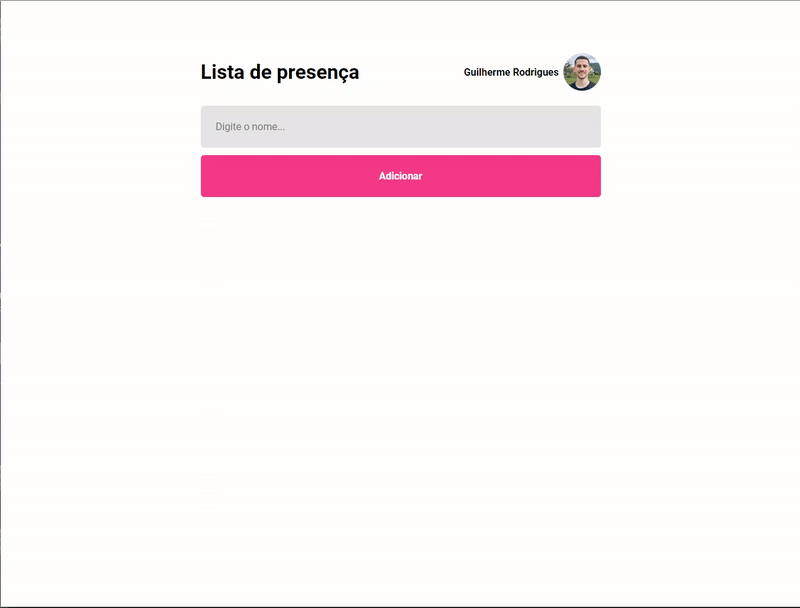

<h1 align="center">Attendance List</h1>

 React fundamentals studies. 

 <a href="#-Worked-concepts">Worked Concepts</a>&nbsp;&nbsp;&nbsp;|&nbsp;&nbsp;&nbsp;
  <a href="#-Project">Project</a>&nbsp;&nbsp;&nbsp;

## 📝 Worked Concepts

- Components
- Props
- State(useState and useEffect)
- Immutability
- GitHub API

## 💻 Project

  

